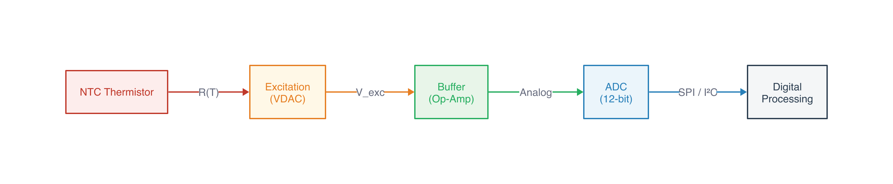
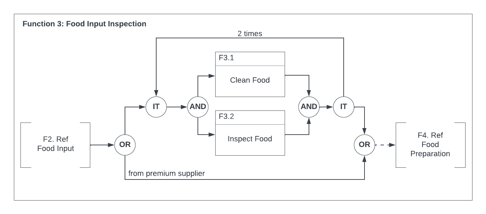
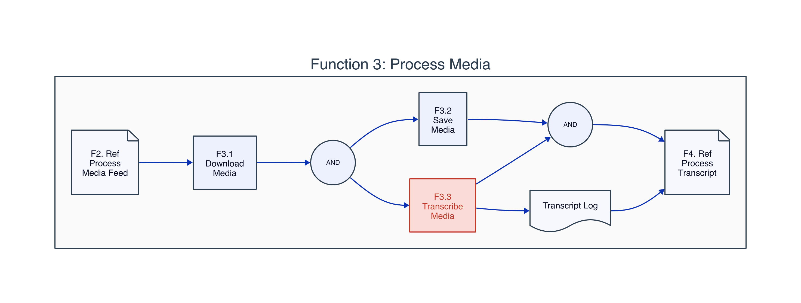
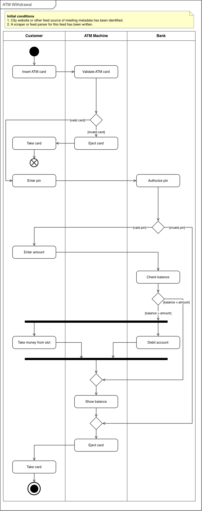
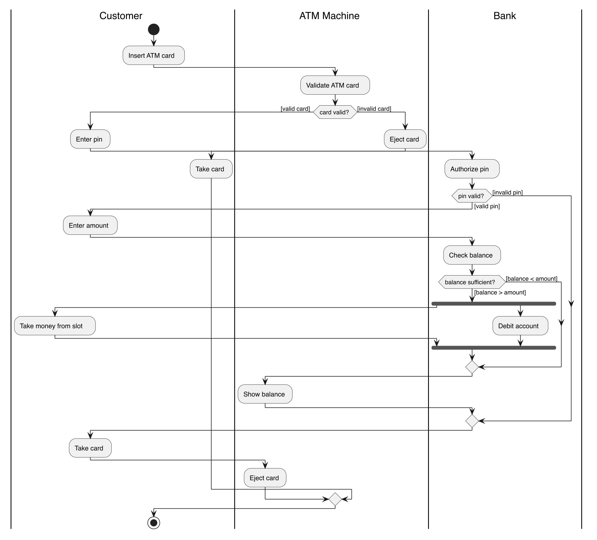
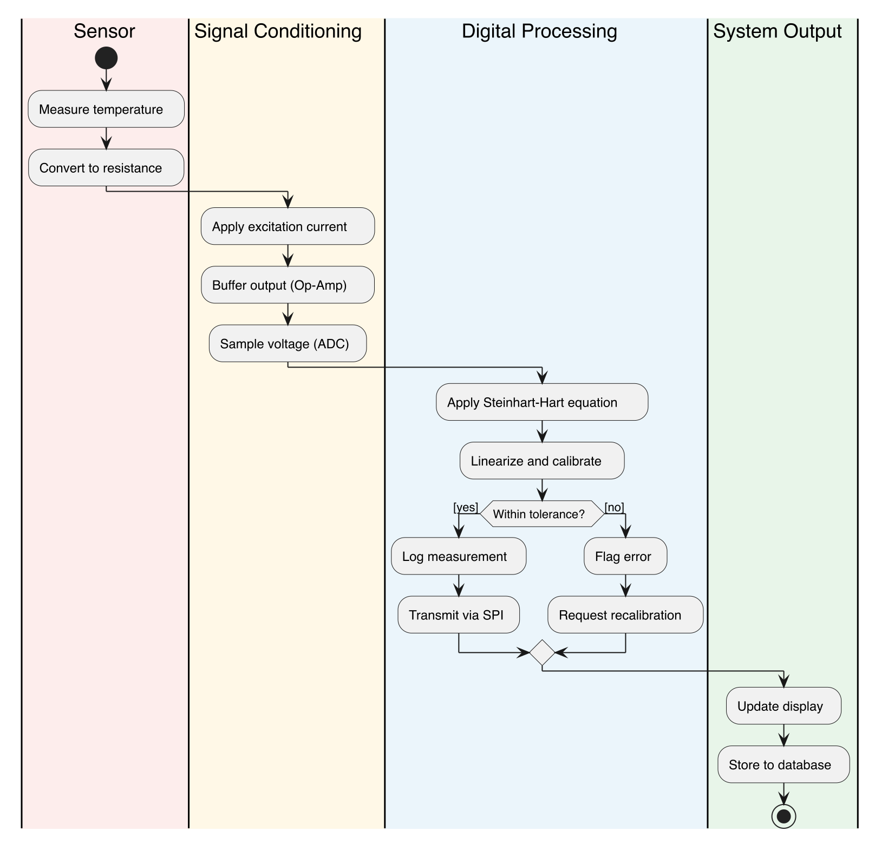

In [Part 1](../2026-06-03-programmatic-circuit-schematics/), I found netlistsvg for producing autorouted circuit schematics from declarative JSON netlists. That solved the hardest asset type in the curriculum pipeline. But a technical curriculum needs more than circuit diagrams. It needs signal flow diagrams, process flows, UML activity and sequence diagrams, and domain-specific notations like Functional Flow Block Diagrams (FFBDs).

The question: can one tool handle all of these, or does each diagram type need its own?

## The Test Cases

I pulled diagrams from two sources: the sensor circuit curriculum (a simple signal conditioning chain) and an eCornell Systems Design course I took previously. While taking the course, I built diagrams in Lucidchart, in some cases replicating course examples. I later converted those Lucidchart diagrams to draw.io using a [custom Claude Code skill](../2026-03-06-drawio-collaborative-diagramming/) that works by directly editing `.drawio` XML files and using desktop window screenshots as a visual feedback loop. There is an [official draw.io MCP](https://github.com/jgraph/drawio-mcp), but my skill doesn't use it. The MCP compresses diagram XML into a URL and opens it in the browser editor, which is effectively one-way. The skill instead writes `.drawio` files directly, the user opens them in draw.io desktop, and Claude screenshots the window to see the rendered result and iterate. This gives Claude a visual feedback loop that the MCP approach lacks. That process is worth its own discussion (see [my earlier post on collaborative diagramming with draw.io](../2026-03-06-drawio-collaborative-diagramming/)), but the key point is that Claude can produce these diagrams, with the caveat that a human needs to review and adjust the layout. The AI generates correct topology and mostly reasonable positioning, but fine-tuning spatial organization is still a manual step.

The resulting diagrams cover the range from simple architecture overviews to standards-compliant engineering notation: FFBDs, context diagrams, activity diagrams with swimlanes, and sequence diagrams.

## Simple Flow Diagrams: d2 vs Mermaid vs netlistsvg

The first test was a straightforward signal conditioning chain: Sensor → Excitation → Buffer → ADC → Digital Processing. Five blocks in a line with labeled arrows.

I tried all three in parallel.

**netlistsvg** (using generic components):

{fig-alt="netlistsvg output showing five generic unnamed rectangles in a row" width="80%"}

The generic component doesn't render block names from the `ref` attribute. netlistsvg is designed for circuits, not labeled block diagrams. The ELK autorouter placed the boxes correctly, but without labels the output is useless.

**d2:**

{fig-alt="d2 output showing five colored blocks connected by labeled arrows: R(T), V_exc, Analog, SPI/I²C" width="100%"}

Clean left-to-right flow, color-coded blocks with fills, labeled arrows between stages. 30 lines of readable markup, rendered in 37ms.

**Mermaid:**

{fig-alt="Mermaid output showing the same signal conditioning chain with colored blocks"}

Very similar to d2. Slightly more compact. The syntax is more widely known (GitHub renders it inline, Obsidian supports it natively). But for a pipeline where we control the rendering, d2's styling is more flexible.

For simple flow diagrams, both d2 and Mermaid work. d2 edges ahead on styling control.

## Complex Process Diagrams: FFBDs

The real test is domain-specific standards. A Functional Flow Block Diagram has specific conventions: OR/AND/IT gate symbols (circles with labels), function blocks with numbered header bars, reference blocks with notched corners, iteration loops with counts, bypass paths, and a containing function boundary.

Here's an FFBD from the eCornell course, produced in draw.io:

{fig-alt="Functional Flow Block Diagram showing F3 Food Input Inspection with OR/AND/IT gates, parallel function blocks, iteration loop marked '2 times', and a bypass path from premium supplier" width="100%"}

I tried reproducing the simpler FFBD (Process Media) in d2:

{fig-alt="d2 diagram showing the Process Media flow with circles for AND gates and a containing boundary, but missing standard FFBD notation" width="100%"}

d2 gets the topology right. The parallel AND fork/join, the containing boundary, the page shapes for reference blocks. But it doesn't know FFBD conventions. The AND gates should be specific symbols, not generic circles. The function blocks should have the characteristic numbered header bar. The IT (iteration) gate is absent entirely. It's a reasonable-looking diagram but not suitable for systems engineering where standard notation matters.

No scriptable tool I've found understands INCOSE/MIL-STD FFBD conventions. This is a gap.

## UML Diagrams: PlantUML

PlantUML knows UML standards. It produces correct notation for activity diagrams, sequence diagrams, use case diagrams, and state machines from declarative text markup.

Here's an activity diagram with swimlanes from the eCornell course (draw.io original):

{fig-alt="UML activity diagram showing an ATM transaction flow across Customer, ATM Machine, and Bank swimlanes with decision diamonds and fork/join bars" width="60%"}

And PlantUML's version of the same diagram:

{fig-alt="PlantUML activity diagram with the same ATM flow, correct UML elements but activities positioned differently within swimlanes" width="60%"}

The UML elements are all correct: rounded activity boxes, decision diamonds with guard conditions, fork/join bars, initial and final nodes, labeled swimlanes. But the spatial organization is looser than the hand-laid-out original. Activities drift horizontally within their swimlanes rather than maintaining consistent alignment. PlantUML's Graphviz-based layout engine doesn't give you control over positioning within lanes.

PlantUML also handles process flows with swimlanes and decision logic:

{fig-alt="PlantUML process diagram showing sensor measurement flow through four colored swimlanes with a decision branch" width="50%"}

For standard UML diagram types, PlantUML is the right tool. The notation is correct, the syntax is declarative, and the rendering is automatic. The layout isn't perfect, but it's good enough for most uses.

## The Assessment

Three tools, each covering a different category:

| Diagram type | Tool | Scriptable | Standards-compliant |
|---|---|---|---|
| Simple flow/architecture | **d2** | Yes | No (but clean) |
| UML (activity, sequence, use case, state) | **PlantUML** | Yes | Yes |
| Domain-specific SE (FFBD, context, N²) | **draw.io** | Semi (manual layout) | Yes (with effort) |

The gap is domain-specific systems engineering notation. FFBDs, context diagrams, and N² charts have conventions that no scriptable tool understands. draw.io is the best option for these, and Claude can generate the initial diagram via the draw.io skill. The workflow is collaborative rather than fully automated: Claude produces the XML with correct topology and standard shapes, you open it in draw.io, adjust positions and fine-tune the layout, and export. It's not a one-command pipeline like netlistsvg, but it's considerably faster than building the diagram from scratch.

This is different from the circuit schematic story in Part 1, where netlistsvg solved the problem completely. For diagrams, the answer is a toolbox, not a single tool. The pipeline uses whichever tool matches the diagram type.

## Tools and Versions

- **d2** (brew): declarative diagrams with ELK layout
- **PlantUML 1.2026.5** (brew): UML diagram generation
- **Mermaid CLI** (npm): evaluated, similar to d2 but less styling control
- **draw.io**: manual layout for domain-specific standards

Combined with Part 1:

- **netlistsvg** (npm): circuit schematics
- **ngspice 44.2**: circuit simulation
- **matplotlib** (Python): data plots
