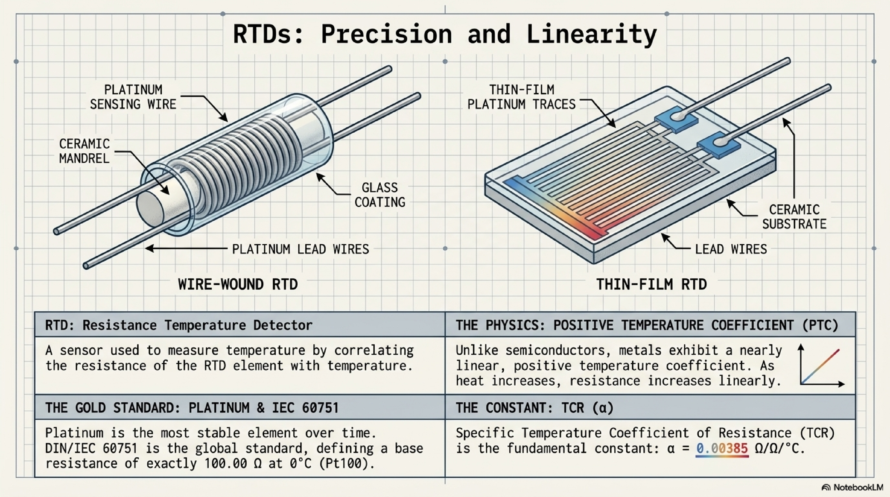
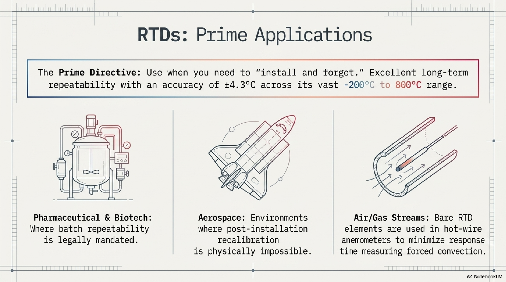
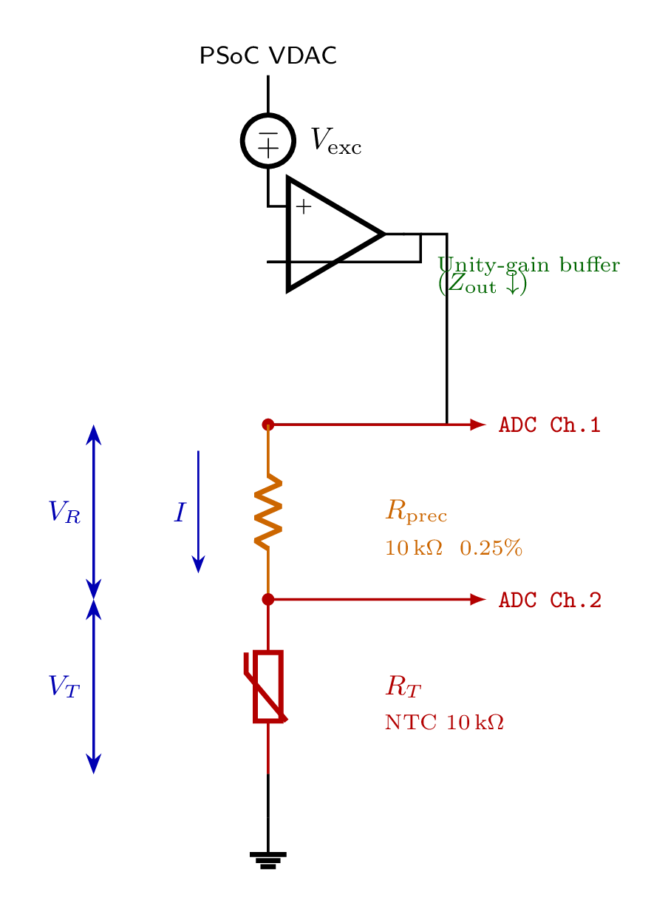
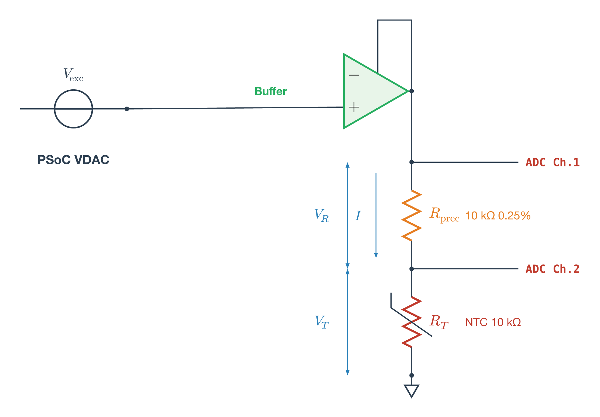
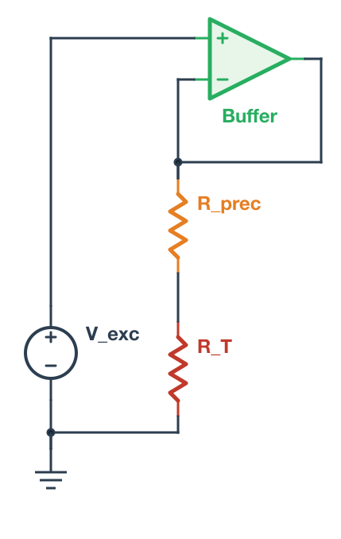
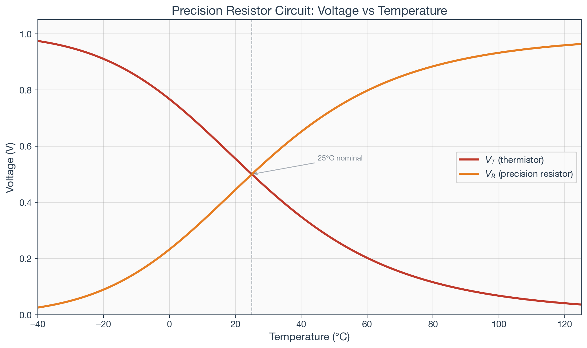
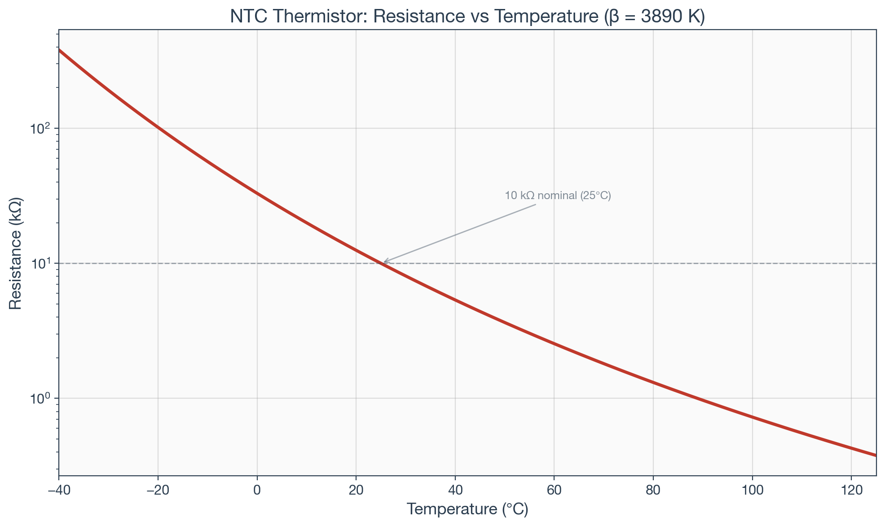
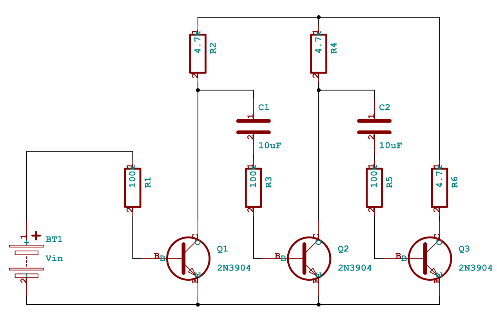
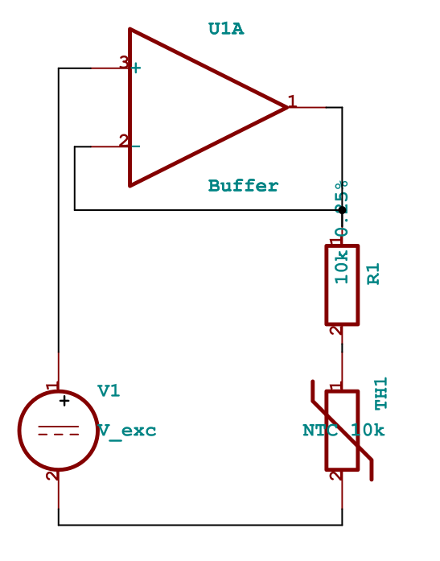

If you're building technical curriculum with circuit schematics, equations, simulation plots, and precise engineering content, you have a tooling problem. The AI-powered tools that produce polished visual output can't be trusted with technical accuracy. The engineering tools that guarantee correctness produce output that looks like engineering documentation, not lecture material. And nothing connects the schematic on your slide to the simulation in your homework.

This is the story of building a pipeline where a single circuit definition produces an autorouted schematic, a SPICE simulation, and styled presentation plots, all from the same source of truth. It started with NotebookLM generating beautiful slides with wrong equations.

## NotebookLM: Beautiful and Wrong

Google's NotebookLM can take lecture transcripts and produce a polished slide deck in minutes. I fed it ten transcripts from UC Boulder's [Sensors and Sensor Circuit Interface Design](https://www.coursera.org/learn/sensors-circuit-interface) course on Coursera, specifically the thermal sensors module, and got back 14 slides.

The design quality is high. This is what NotebookLM produces from raw transcripts, with no design input:

{fig-alt="NotebookLM-generated slide showing wire-wound and thin-film RTD construction with detailed labels and clean layout"}

The problem is accuracy. Five of the fourteen slides contained errors, including incorrect Callendar-Van Dusen equation coefficients and this:

{fig-alt="NotebookLM slide claiming RTD accuracy of ±4.3°C, which is actually a tolerance class specification from IEC 60751, not a general accuracy claim"}

"Excellent long-term repeatability with an accuracy of ±4.3°C." That ±4.3°C figure is actually the Class B tolerance at the extremes of the -200°C to 800°C range per IEC 60751. It's not "the accuracy of RTDs." A Class A Pt100 at 0°C has a tolerance of ±0.15°C. Presenting ±4.3°C as the headline accuracy number would give students a wrong understanding of why RTDs are valued for precision measurement.

These aren't formatting issues. They're the kind of mistakes that would teach students the wrong thing. The core tension: the tool that produces the best-looking slides can't be trusted with the content.

## The AI Slide API Detour

The next thought was to find an AI slide service with an API, feed it vetted content, and control accuracy from the source side. I evaluated four services: [Gamma](https://gamma.app), [2Slides](https://2slides.com), [SlidesGPT](https://slidesgpt.com), and [FlashDocs](https://flashdocs.ai).

2Slides has two generation modes. "Fast PPT" produces template-based PowerPoint for ~20 credits. Uninspiring. The interesting mode uses Nano Banana, Google's Gemini image generation model, which 2Slides integrates as its AI-designed layout engine. The output was visually competitive:

{fig-alt="AI-generated slide showing thermistor excitation circuit with schematic, equations, and self-heating analysis in a professional layout" width="100%"}

The content was largely accurate. It even computed self-heating more precisely than my notes (0.156 mW vs. my rounded 0.16 mW). But the schematic conflates the VDAC and the op-amp buffer into a single "Voltage Source" block, losing a key teaching point: the buffer exists because the VDAC has 16 kΩ output impedance and can't drive the measurement chain directly. And because each slide is a generated raster image, fixing that means regenerating the entire slide and hoping nothing else changes. At ~110 credits per slide with 500 free credits to start, iteration is expensive.

This clarified the fundamental problem. AI tools can do layout and visual design. They cannot be trusted with technical content. And their outputs aren't editable. For a curriculum pipeline, you need the opposite: guaranteed technical accuracy with styling applied afterward.

## Declaring Circuits, Not Drawing Them

The answer turned out to be declaring circuit topology and letting a layout engine handle the visual arrangement. The same principle behind Graphviz for flowcharts, applied to circuit schematics. But getting there required ruling out every tool that doesn't have autorouting first.

### The Test Circuit

I tested every tool on the same circuit from the UC Boulder course: a precision resistor excitation method for thermistor measurement. The instructor presents it as a cost-optimized design for the PSoC 5LP kit. The PSoC's VDAC has up to 5% gain error, but by measuring current through a 0.25% precision resistor (5 cents from Stackpole), the measurement accuracy depends on the resistor rather than the DAC. An op-amp buffer provides current drive since the VDAC's output impedance can reach 16 kΩ. Two ADC channels tap the voltage across each component.

It's a real teaching circuit with enough topological complexity to stress-test a schematic tool: voltage source, op-amp buffer with feedback, two resistors in series, two ADC measurement taps, and a ground reference.

### Manual Coordinate Placement: The Common Failure Mode

I tried CircuiTikZ (LaTeX), Schemdraw (Python), Typst+Zap, and KiCad's Python API. They all failed for the same reason.

Every one of these tools requires you to specify component positions and wire paths in absolute coordinates. CircuiTikZ took four iterations just to resolve label collisions:

{fig-alt="CircuiTikZ schematic with correct symbols but awkward label positioning around the op-amp area" width="60%"}

Typst+Zap had the fastest compile cycle (~100ms) and the best styling system: per-component colors, custom fonts, the works. The measurement chain looked good. But the op-amp routing was a persistent mess:

{fig-alt="Typst+Zap schematic with color-coded components but awkward routing around the op-amp and voltage source" width="50%"}

KiCad's Python API generates `.kicad_sch` files with professional symbols, the best rendering of any tool, but the API doesn't invoke KiCad's autorouter. Same coordinate problem, different file format.

I also tried MATLAB's Simscape Electrical, which does have autorouting. The layout it produced was the cleanest of any tool. But the workflow was untenable: library paths contain literal newline characters, port names must be discovered by trial and error, and an interactive MATLAB session is required. Not a pipeline tool.

The pattern: every tool without autorouting required pixel-pushing in a different programming language. The layout is the hard part, not the rendering.

### netlistsvg: The Graphviz of Circuits

[netlistsvg](https://github.com/nturley/netlistsvg) takes a JSON netlist and produces an SVG schematic with automatic layout via the [ELK](https://www.eclipse.org/elk/) graph layout engine. You declare components and connections. No coordinates, no wire paths:

```json
{
  "modules": {
    "circuit": {
      "cells": {
        "V_exc": {
          "type": "v",
          "connections": { "+": [2], "-": [5] }
        },
        "Buffer": {
          "type": "op",
          "connections": { "+": [2], "-": [3], "OUT": [3] }
        },
        "R_prec": {
          "type": "r_v",
          "connections": { "A": [3], "B": [4] }
        },
        "R_T": {
          "type": "r_v",
          "connections": { "A": [4], "B": [5] }
        },
        "GND": {
          "type": "gnd",
          "connections": { "A": [5] }
        }
      }
    }
  }
}
```

The Buffer's output and inverting input both connect to net 3. That's the feedback path. R_prec and R_T share net 4. That's the measurement node. ELK figures out where everything goes:

```bash
netlistsvg circuit.json -o output.svg --skin skin_custom.svg
```

{fig-alt="Circuit schematic showing voltage source, op-amp buffer with feedback, precision resistor and NTC thermistor in series, with ground. Components are color-coded: green op-amp, orange precision resistor, red thermistor." width="40%"}

A few gotchas: the type names in the JSON must match the skin's alias definitions (`r_v` not `resistor_v`, `op` not `opamp`). And ImageMagick can't correctly render netlistsvg's SVG output; use `rsvg-convert` instead.

The skin file is a single SVG that controls component symbols, CSS styling, ELK layout parameters, and fonts. I replaced the IEC rectangular resistors with IEEE zigzag symbols, added +/− polarity signs, and added per-component colors:

```css
.symbol.cell_R_prec { stroke: #E67E22; stroke-width: 2.5; }
.symbol.cell_R_T { stroke: #C0392B; stroke-width: 2.5; }
.symbol.cell_Buffer { stroke: #27AE60; fill: #E8F5E9; }
```

One skin file controls the visual language for every schematic in the curriculum. Change the color palette once and every circuit updates.

## From Schematic to Simulation

The real payoff came from a property of the netlist format that wasn't immediately obvious. The shared net numbers aren't a layout hint. They define actual circuit connectivity. Net 3 connecting the buffer output, the buffer inverting input, and R_prec pin A is a real electrical node.

The same topology maps directly to a SPICE netlist:

```spice
V_exc 2 0 DC 1.0
E_buf 3 0 2 3 1e6
R_prec 3 4 10k
R_T 4 0 10k
```

Same nodes, same connections, different format. I ran this through [ngspice](https://ngspice.sourceforge.io/), sweeping NTC resistance across -40°C to 125°C. The simulation verified the expected behavior and produced presentation-ready plots rendered with matplotlib using the same color scheme as the schematic skin:

{fig-alt="Plot of V_T and V_R versus temperature from -40°C to 125°C, crossing at 25°C where both resistances are equal."}

{fig-alt="Log-scale plot showing NTC resistance dropping from 380 kΩ at -40°C to 377 Ω at 125°C."}

### Single Source of Truth

The architecture:

```
Circuit definition (canonical)
  ├── netlistsvg JSON → autorouted SVG schematic
  ├── SPICE netlist  → ngspice → numerical verification
  └── matplotlib     → styled plots from circuit parameters
```

One circuit definition. Three outputs. If R_prec changes from 10kΩ to 100kΩ, the schematic updates, the simulation re-runs, and the plots reflect the new operating point. The lecture slide schematic, the homework simulation, and the lab reference all derive from the same source. No divergence.

## Update: netlistsvg's Limits and SKiDL

After publishing this article, I tested netlistsvg on more complex circuits. A 3-stage common-emitter amplifier exposed a fundamental limitation: ELK is a general-purpose graph layout engine that doesn't understand EE spatial conventions. It scattered the three amplifier stages across the diagram instead of arranging them in the conventional left-to-right column layout that any textbook would use.

[SKiDL](https://github.com/devbisme/skidl) solved this. It's a Python library that defines circuits programmatically (like netlistsvg's JSON but in Python), uses KiCad's professional symbol library, and has a layout engine specifically designed for circuit schematics. The same 3-stage amplifier that ELK mangled, SKiDL arranged with transistors in a row, collector resistors above, coupling capacitors between stages, exactly as you'd draw it by hand:

{fig-alt="Three-stage common-emitter amplifier schematic generated by SKiDL showing three transistor stages in conventional left-to-right arrangement with coupling capacitors between stages" width="80%"}

SKiDL required one bug fix for KiCad 10 compatibility: a `KeyError: 'bottom'` in `gen_svg.py` where the justify value dict was missing `"bottom"` and `"top"` entries. A one-line patch.

The revised pipeline uses both tools:

- **netlistsvg** for simple circuits where the JSON format is convenient and ELK's layout is adequate (voltage dividers, basic measurement circuits)
- **SKiDL** for complex circuits where EE spatial conventions matter (multi-stage amplifiers, bridges, anything with repeating structural patterns)

SKiDL also handles simple circuits well. Here's the same precision resistor circuit from earlier, generated by SKiDL with a proper circle voltage source, op-amp buffer, and thermistor:

{fig-alt="Precision resistor excitation circuit generated by SKiDL showing voltage source, op-amp buffer with feedback, precision resistor, and NTC thermistor" width="40%"}

Both define real circuit connectivity that maps to SPICE simulation. Both produce SVG. The single-source-of-truth architecture holds.

## Progressive Annotations for Teaching

For lecture slides, static schematics aren't enough. You need to build up a diagram step by step: show the circuit first, then reveal node labels, then current direction, then voltage polarities, then the governing equation.

The approach that works: inline the SVG in a Quarto Reveal.js slide, wrap annotation groups in `class="fragment"` attributes, and Reveal.js handles the progressive reveal on each arrow-key press. Annotations are SVG elements (text labels, elliptical current arrows, polarity marks, colored node dots) placed at coordinates parsed from the base schematic. Equations go in a Quarto column beside the diagram using proper LaTeX rendering.

This requires the SVG to be inline in the HTML (not an external file reference) because Reveal.js fragment classes only work on elements in the DOM. A Python script parses the netlistsvg or SKiDL output, extracts component positions, computes annotation placements, and generates the `.qmd` slide.

Here's a KVL mesh analysis example built this way. The base circuit is generated by netlistsvg, then a script parses the SVG, adds node labels, a mesh current ellipse, and voltage polarity marks as progressive Reveal.js fragments. [Try the interactive slide demo](kvl_demo.qmd) — use arrow keys to step through each reveal.

## The Pipeline So Far

```
Circuit definition (netlistsvg JSON or SKiDL Python)
  ├── SVG schematic (autorouted)
  ├── SPICE netlist (same connectivity)
  ├── Annotation script → inline SVG with Reveal.js fragments
  └── matplotlib → styled plots from simulation
```

The remaining pieces of the curriculum engine (covered in subsequent posts): block diagrams (d2, PlantUML), presentation framework (Quarto), interactive exercises (quarto-live with Pyodide), and graded assignments (GitHub Actions).

## Tools and Versions

- **netlistsvg** (npm): JSON netlist to autorouted SVG via ELK (simple circuits)
- **SKiDL 2.2.3** (pip): Python circuit definition to SVG via KiCad symbols (complex circuits)
- **ngspice 44.2**: open-source SPICE simulation
- **matplotlib** (Python): styled data visualization
- **Quarto 1.8**: presentation framework (Reveal.js slides, PDF, web)
- **rsvg-convert**: SVG to PNG (use instead of ImageMagick for netlistsvg output)

Evaluated and rejected: CircuiTikZ (TeX Live 2025), Schemdraw 0.23, Typst 0.14.2 + Zap 0.5.0, KiCad 10.0.3 + kicad-sch-api 0.5.6, MATLAB R2026a + Simscape Electrical, 2Slides API (Gemini/Nano Banana image gen), NotebookLM.
